# Company Evaluator — Phase A Cross-Sectional Audit

Generated: 2026-04-16 20:16:29 UTC
Universe size (evaluated, filtered): 2125
Evaluation version filter: `0.2.0`
Code tag: `pre-backtest-phase-a-dirty`

## Executive Summary
- ✅ **No redundant pillar pair** (Analysis 1): max |Pearson r| = 0.58 < 0.7 between any two pillar scores.
- ✅ **Multi-factor framework retained** (Analysis 3): PC1 = 47.7% < 50% — pillars genuinely capture distinct dimensions rather than collapsing to a single axis.
- ✅ **Composite distribution is well-shaped** (Analysis 5): skew=0.04, excess kurtosis=-0.31 — symmetric and platykurtic, clean discrimination across the universe.
- ⚠️ **P2 sub-metric coverage (data-provider gap).** `debt_to_ebitda` and `sga_efficiency` fall below 50% coverage primarily because Polygon does not populate `long_term_debt` and `selling_general_administrative` for many financials, REITs, and utilities — not because of sentinel coercion. The only string sentinel in P2 is `no_debt` on `interest_coverage`, which is already mapped to score=100 in the scoring layer. (The `routine_selling` sentinel lives in P3's smart-money analyzer and the breakout logic; it does not touch P2.) Full normalization details are in `docs/P2_NORMALIZATION_REFERENCE.md`.

## 1. Pillar correlation matrix
**Interpretation:** Pairwise Pearson correlations between the 5 pillar scores run at mean |r|=0.34 with max |r|=0.58. Low-to-moderate correlation is healthy: it means pillars capture different dimensions of quality. Values above 0.7 would indicate redundancy; values near 0 mean independence.

**Stats:**
- `n_symbols` = 1871
- `pearson_mean_abs` = 0.3352
- `pearson_max_abs` = 0.5781

**Table — pearson:**

|  | P1 BizQual | P2 OpsHealth | P3 CapAlloc | P4 Growth | P5 Val |
| --- | --- | --- | --- | --- | --- |
| P1 BizQual | 1.000 | 0.420 | 0.578 | 0.334 | 0.430 |
| P2 OpsHealth | 0.420 | 1.000 | 0.397 | 0.306 | 0.219 |
| P3 CapAlloc | 0.578 | 0.397 | 1.000 | 0.175 | 0.332 |
| P4 Growth | 0.334 | 0.306 | 0.175 | 1.000 | 0.160 |
| P5 Val | 0.430 | 0.219 | 0.332 | 0.160 | 1.000 |

**Table — spearman:**

|  | P1 BizQual | P2 OpsHealth | P3 CapAlloc | P4 Growth | P5 Val |
| --- | --- | --- | --- | --- | --- |
| P1 BizQual | 1.000 | 0.429 | 0.545 | 0.325 | 0.448 |
| P2 OpsHealth | 0.429 | 1.000 | 0.401 | 0.298 | 0.215 |
| P3 CapAlloc | 0.545 | 0.401 | 1.000 | 0.159 | 0.350 |
| P4 Growth | 0.325 | 0.298 | 0.159 | 1.000 | 0.145 |
| P5 Val | 0.448 | 0.215 | 0.350 | 0.145 | 1.000 |

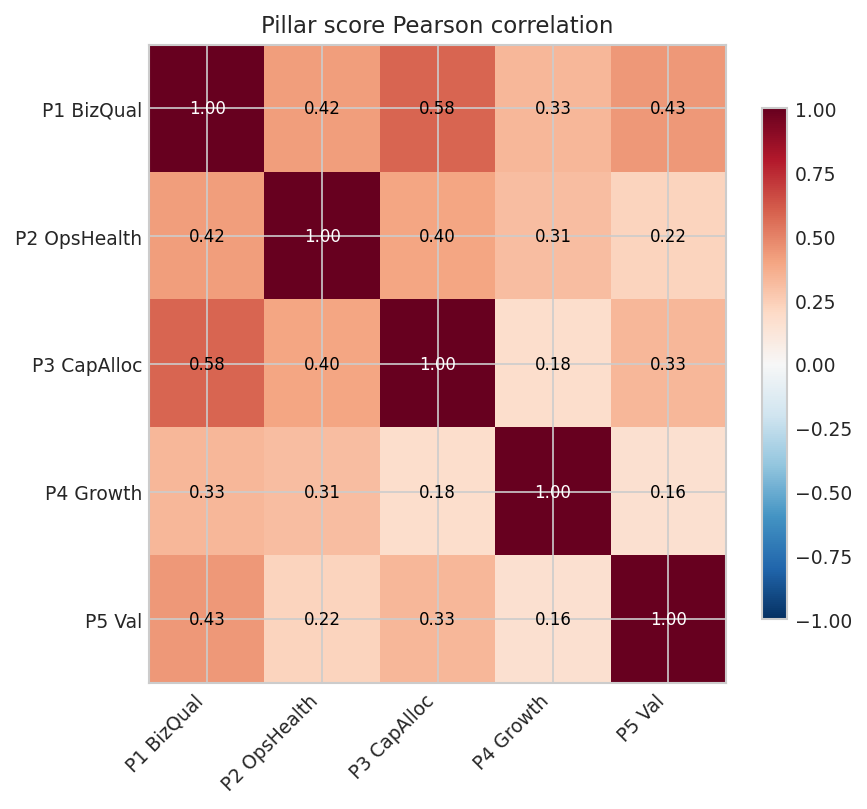


## 2. Within-pillar metric correlation
**Interpretation:** Within each pillar, sub-metrics are expected to be moderately correlated (they measure related aspects of the same dimension) but not redundant. Look for pairs with |r|>0.85 — those are candidates for consolidation. Pairs near r=0 suggest the sub-metric is measuring something orthogonal to the rest of its pillar, which may be a design feature or a mismatch.

**Stats:**
- `pillar_1_mean_abs_r` = 0.2025
- `pillar_1_max_abs_r` = 0.8483
- `pillar_1_n` = 2125
- `pillar_2_mean_abs_r` = 0.1249
- `pillar_2_max_abs_r` = 0.5089
- `pillar_2_n` = 2125
- `pillar_3_mean_abs_r` = 0.1338
- `pillar_3_max_abs_r` = 0.2092
- `pillar_3_n` = 2125
- `pillar_4_mean_abs_r` = 0.3048
- `pillar_4_max_abs_r` = 0.7046
- `pillar_4_n` = 2125
- `pillar_5_mean_abs_r` = 0.2334
- `pillar_5_max_abs_r` = 0.6011
- `pillar_5_n` = 2125

**Table — pillar_1:**

|  | roic | gross_margin | op_margin | net_margin | fcf_yield | rev_stability |
| --- | --- | --- | --- | --- | --- | --- |
| roic | 1.000 | 0.116 | 0.423 | 0.419 | 0.125 | 0.090 |
| gross_margin | 0.116 | 1.000 | 0.354 | 0.336 | 0.008 | -0.025 |
| op_margin | 0.423 | 0.354 | 1.000 | 0.848 | 0.015 | -0.003 |
| net_margin | 0.419 | 0.336 | 0.848 | 1.000 | 0.039 | -0.047 |
| fcf_yield | 0.125 | 0.008 | 0.015 | 0.039 | 1.000 | 0.190 |
| rev_stability | 0.090 | -0.025 | -0.003 | -0.047 | 0.190 | 1.000 |

**Table — pillar_2:**

|  | interest_coverage | current_ratio | cash_conversion | altman_z |
| --- | --- | --- | --- | --- |
| interest_coverage | 1.000 | -0.051 | -0.001 | 0.143 |
| current_ratio | -0.051 | 1.000 | -0.044 | 0.509 |
| cash_conversion | -0.001 | -0.044 | 1.000 | -0.001 |
| altman_z | 0.143 | 0.509 | -0.001 | 1.000 |

**Table — pillar_3:**

|  | roic_wacc_spread | share_trend | dividend_sustain | insider_activity |
| --- | --- | --- | --- | --- |
| roic_wacc_spread | 1.000 | 0.209 | 0.134 | -0.060 |
| share_trend | 0.209 | 1.000 | 0.204 | -0.045 |
| dividend_sustain | 0.134 | 0.204 | 1.000 | -0.150 |
| insider_activity | -0.060 | -0.045 | -0.150 | 1.000 |

**Table — pillar_4:**

|  | revenue_cagr_3y | revenue_cagr_5y | fcf_growth | margin_trend |
| --- | --- | --- | --- | --- |
| revenue_cagr_3y | 1.000 | 0.705 | 0.270 | 0.258 |
| revenue_cagr_5y | 0.705 | 1.000 | 0.353 | 0.121 |
| fcf_growth | 0.270 | 0.353 | 1.000 | 0.122 |
| margin_trend | 0.258 | 0.121 | 0.122 | 1.000 |

**Table — pillar_5:**

|  | ev_ebitda | pe_ratio | pfcf | earnings_quality | analyst_consensus |
| --- | --- | --- | --- | --- | --- |
| ev_ebitda | 1.000 | 0.601 | 0.429 | -0.017 | -0.146 |
| pe_ratio | 0.601 | 1.000 | 0.523 | -0.225 | -0.204 |
| pfcf | 0.429 | 0.523 | 1.000 | -0.006 | -0.167 |
| earnings_quality | -0.017 | -0.225 | -0.006 | 1.000 | 0.017 |
| analyst_consensus | -0.146 | -0.204 | -0.167 | 0.017 | 1.000 |

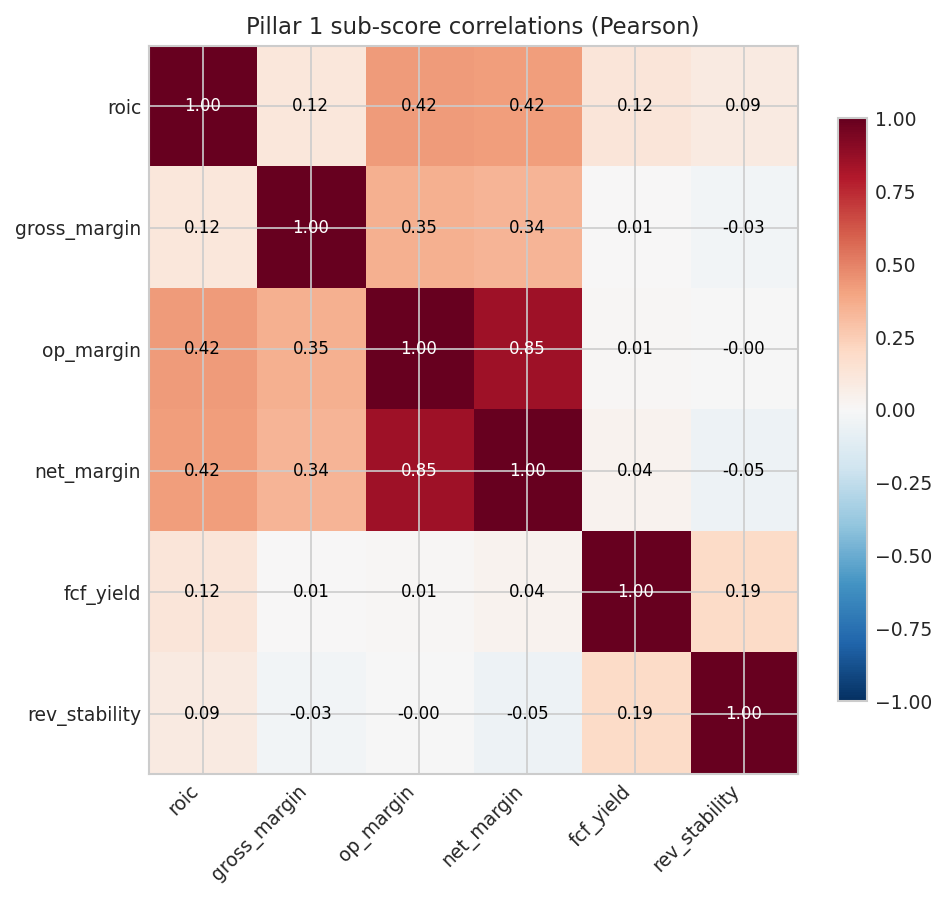

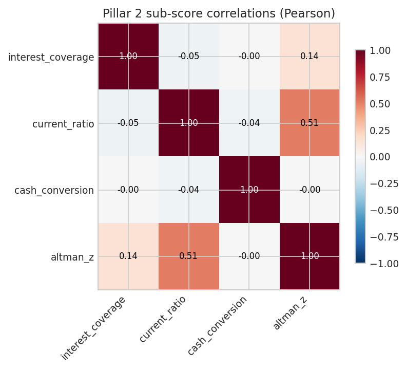

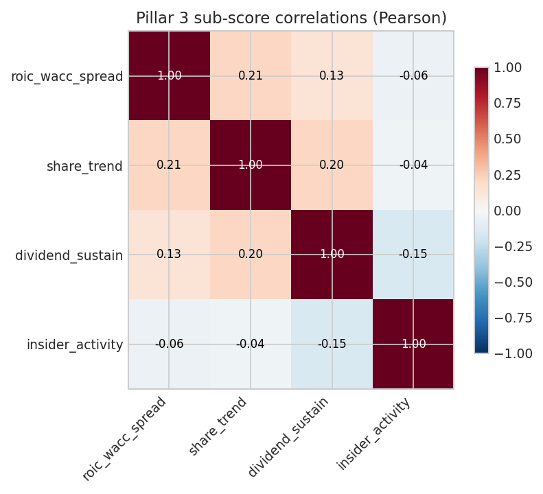

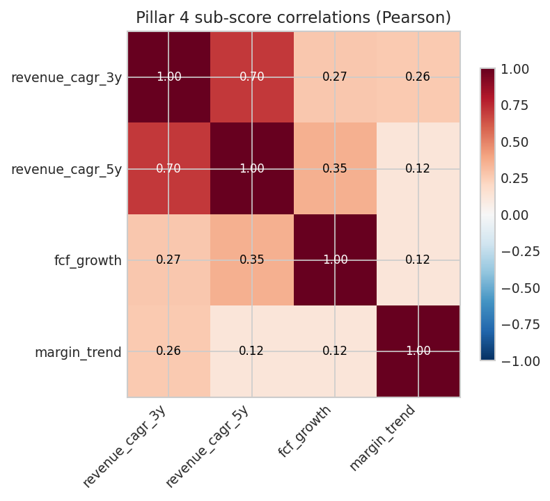

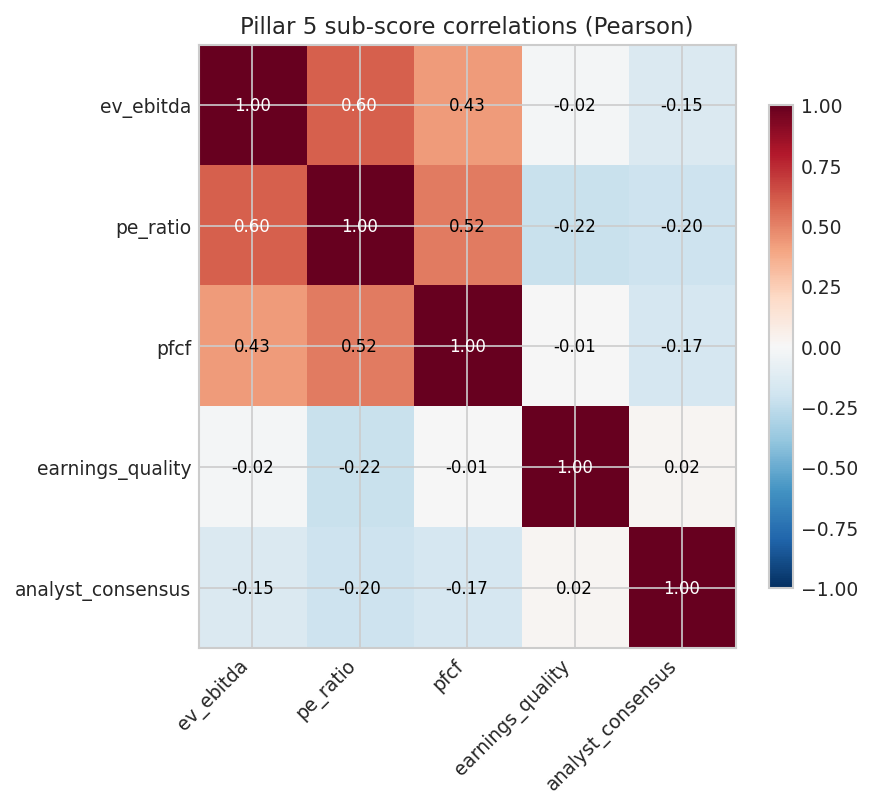

**Notes:**
- pillar_2: dropped low-coverage sub-metrics ['debt_to_ebitda', 'sga_efficiency']
- pillar_3: dropped low-coverage sub-metrics ['rd_intensity']
- pillar_4: dropped low-coverage sub-metrics ['eps_growth']

## 3. PCA on pillar scores
**Interpretation:** PC1 explains 47.7% of variance across the 5 pillars (PC1+PC2 = 65.8%). PC1's largest absolute loading is on **P1 BizQual** (-0.54), suggesting this pillar dominates the first axis. If PC1>70% the framework collapses toward a single dimension; if PC1<40% the pillars are closer to genuinely orthogonal.

**Stats:**
- `n` = 1871
- `pc1_explained` = 0.477
- `pc1_pc2_cumulative` = 0.6578
- `all_explained_variance` = [0.477, 0.1809, 0.149, 0.1164, 0.0768]

**Table — explained_variance:**

|  | component | eigenvalue | explained_variance | cumulative_variance |
| --- | --- | --- | --- | --- |
| 0 | PC1 | 2.386 | 0.477 | 0.477 |
| 1 | PC2 | 0.905 | 0.181 | 0.658 |
| 2 | PC3 | 0.745 | 0.149 | 0.807 |
| 3 | PC4 | 0.582 | 0.116 | 0.923 |
| 4 | PC5 | 0.384 | 0.077 | 1.000 |

**Table — loadings:**

|  | PC1 | PC2 | PC3 | PC4 | PC5 |
| --- | --- | --- | --- | --- | --- |
| P1 BizQual | -0.543 | 0.111 | -0.005 | -0.321 | -0.768 |
| P2 OpsHealth | -0.442 | -0.292 | -0.482 | 0.697 | -0.017 |
| P3 CapAlloc | -0.491 | 0.281 | -0.386 | -0.446 | 0.576 |
| P4 Growth | -0.336 | -0.770 | 0.446 | -0.222 | 0.216 |
| P5 Val | -0.395 | 0.480 | 0.648 | 0.403 | 0.176 |

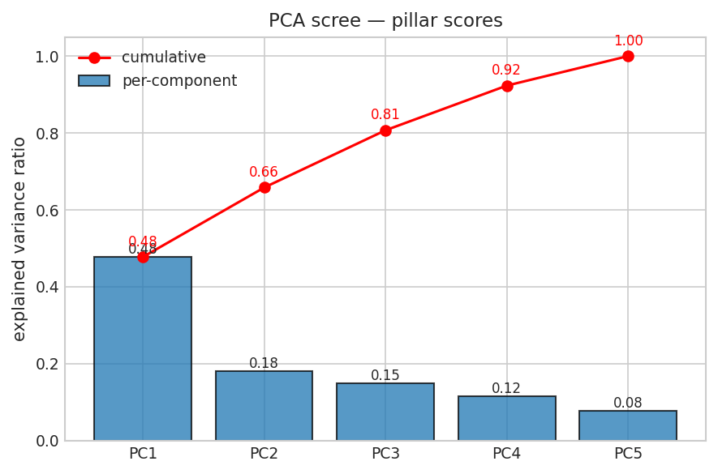

## 4. Pillar score distributions
**Interpretation:** Pillar means range from 30.6 (P3 CapAlloc) to 49.2 (P5 Val); stdevs range from 16.3 to 24.3. A pillar with very low stdev discriminates poorly across companies; a pillar with a mean far from 50 may be too easy or too hard to score.

**Stats:**
- `pillar_means`:
    - `P1 BizQual` = 30.82
    - `P2 OpsHealth` = 37.94
    - `P3 CapAlloc` = 30.6
    - `P4 Growth` = 40.67
    - `P5 Val` = 49.2
- `pillar_stdevs`:
    - `P1 BizQual` = 20.77
    - `P2 OpsHealth` = 20.09
    - `P3 CapAlloc` = 16.29
    - `P4 Growth` = 24.32
    - `P5 Val` = 21.22

**Table — stats:**

| pillar | n | mean | stdev | min | p25 | median | p75 | max | iqr | skew | kurtosis |
| --- | --- | --- | --- | --- | --- | --- | --- | --- | --- | --- | --- |
| P1 BizQual | 2125.000 | 30.820 | 20.774 | 0.000 | 15.000 | 28.400 | 44.800 | 96.400 | 29.800 | 0.456 | -0.434 |
| P2 OpsHealth | 2123.000 | 37.937 | 20.094 | 0.000 | 22.800 | 37.500 | 52.150 | 97.700 | 29.350 | 0.205 | -0.477 |
| P3 CapAlloc | 2125.000 | 30.602 | 16.291 | 0.000 | 17.400 | 28.200 | 42.200 | 87.100 | 24.800 | 0.488 | -0.241 |
| P4 Growth | 1872.000 | 40.666 | 24.325 | 0.000 | 22.275 | 40.750 | 59.325 | 100.000 | 37.050 | 0.122 | -0.664 |
| P5 Val | 2125.000 | 49.195 | 21.217 | 0.000 | 32.100 | 49.200 | 66.600 | 96.600 | 34.500 | -0.042 | -0.873 |

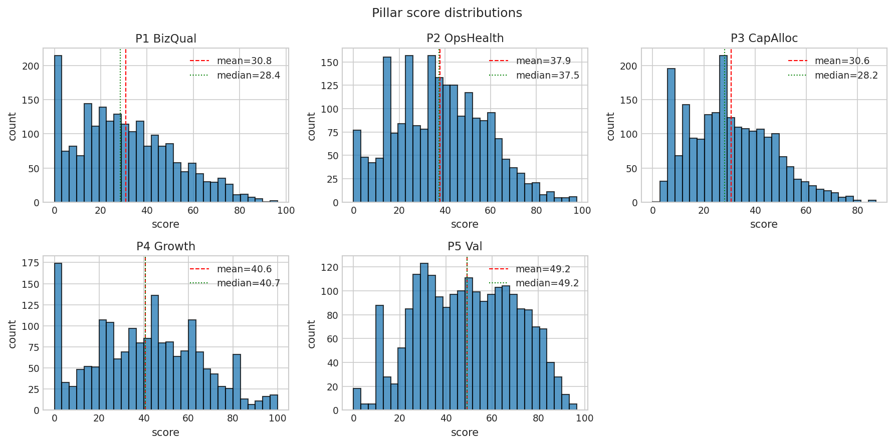

## 5. Composite score distribution
**Interpretation:** Composite scores span [1.6, 83.5] with mean=35.60, median=35.50, stdev=14.48, skew=0.04, excess kurtosis=-0.31. At n=2125 any formal normality test will almost certainly reject — trivially small deviations are statistically significant at this sample size. The practical questions are: does the shape discriminate (IQR 19.7, stdev 14.48) and is it grossly bimodal/spiky. Anderson-Darling statistic reported for completeness; treat skew and kurtosis as the operative summaries.

**Stats:**
- `n` = 2125
- `mean` = 35.5972705882353
- `stdev` = 14.480868997914156
- `min` = 1.6
- `p25` = 25.9
- `median` = 35.5
- `p75` = 45.6
- `max` = 83.5
- `iqr` = 19.700000000000003
- `skew` = 0.03655896798668
- `kurtosis` = -0.30557996824373923
- `anderson_darling_stat` = 0.9293
- `anderson_darling_crit_5pct` = 0.752
- `shapiro_wilk_stat` = 0.9961
- `shapiro_wilk_p` = 2.4e-05

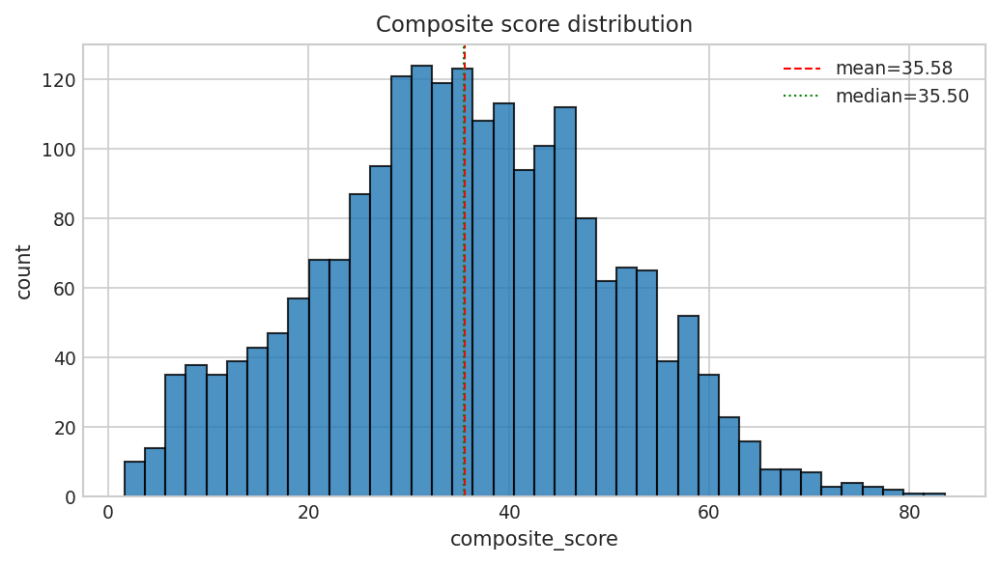

**Notes:**
- Normality test reported but not weighted heavily at n=2000+; use skew/kurtosis for shape assessment.

## 6. Pillar contribution analysis
**Interpretation:** **P1 BizQual** is the largest weighted contributor for 39.8% of symbols. Because weights are fixed, a pillar with a larger weight AND higher typical score will dominate — this is by design for P1 (weight=30%). If a pillar with a small weight dominates, its score distribution is running hot relative to the others.

**Stats:**
- `n` = 1871
- `top_contributor` = P1 BizQual
- `top_contributor_pct` = 39.82
- `mean_contribution`:
    - `P1 BizQual` = 9.495
    - `P2 OpsHealth` = 5.72
    - `P3 CapAlloc` = 6.154
    - `P4 Growth` = 8.132
    - `P5 Val` = 7.423

**Table — summary:**

| pillar | top_count | top_pct | weight_pct |
| --- | --- | --- | --- |
| P1 BizQual | 745.000 | 39.820 | 30.000 |
| P4 Growth | 544.000 | 29.080 | 20.000 |
| P5 Val | 336.000 | 17.960 | 15.000 |
| P2 OpsHealth | 124.000 | 6.630 | 15.000 |
| P3 CapAlloc | 122.000 | 6.520 | 20.000 |

**Table — mean_contribution:**

|  | mean |
| --- | --- |
| P1 BizQual | 9.495 |
| P2 OpsHealth | 5.720 |
| P3 CapAlloc | 6.154 |
| P4 Growth | 8.132 |
| P5 Val | 7.423 |

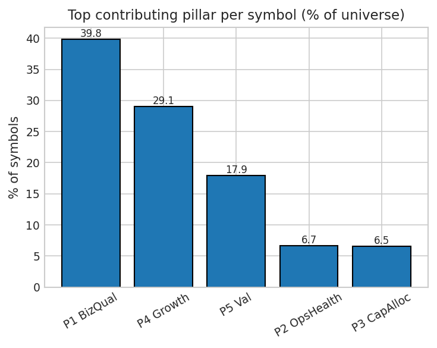

## 7. Sector by composite decile + pillar-mean-by-sector
**Interpretation:** Top decile (D1) sector concentration: Financial Services 17.4%, Technology 17.4%, Industrials 11.3%, Healthcare 8.4%, Consumer Cyclical 8.0%. The pillar-by-sector heatmap reveals whether a specific pillar systematically penalizes a specific sector — cells well below the row/column mean indicate structural mis-calibration (e.g., P3 punishing sectors with low dividend cultures).

**Stats:**
- `n` = 2121
- `top_decile_top_sectors`:
    - `Financial Services` = 17.37
    - `Technology` = 17.37
    - `Industrials` = 11.27
    - `Healthcare` = 8.45
    - `Consumer Cyclical` = 7.98

**Table — sector_pct_by_decile:**

| decile | Aerospace & Defense | Airlines | Auto Components | Automobiles | BLANK CHECKS | Banking | Basic Materials | Beverages | Biotechnology | Building | Chemicals | Commercial Services & Supplies | Communication Services | Communications | Construction | Consumer Cyclical | Consumer Defensive | Consumer products | Distributors | Diversified Consumer Services | Electrical Equipment | Energy | Financial Services | Food Products | Health Care | Healthcare | Hotels, Restaurants & Leisure | Industrial Conglomerates | Industrials | Insurance | Leisure Products | Life Sciences Tools & Services | Logistics & Transportation | Machinery | Marine | Media | Metals & Mining | N/A | Packaging | Paper & Forest | Pharmaceuticals | Professional Services | REAL ESTATE INVESTMENT TRUSTS | Real Estate | Retail | Road & Rail | Semiconductors | Technology | Telecommunication | Textiles, Apparel & Luxury Goods | Trading Companies & Distributors | Transportation Infrastructure | Utilities |
| --- | --- | --- | --- | --- | --- | --- | --- | --- | --- | --- | --- | --- | --- | --- | --- | --- | --- | --- | --- | --- | --- | --- | --- | --- | --- | --- | --- | --- | --- | --- | --- | --- | --- | --- | --- | --- | --- | --- | --- | --- | --- | --- | --- | --- | --- | --- | --- | --- | --- | --- | --- | --- | --- |
| D1 | 0.000 | 0.000 | 0.470 | 0.000 | 0.000 | 1.410 | 3.760 | 0.940 | 2.350 | 0.000 | 0.470 | 0.000 | 2.350 | 0.940 | 0.000 | 7.980 | 4.230 | 0.470 | 0.000 | 0.470 | 0.470 | 6.100 | 17.370 | 0.000 | 0.000 | 8.450 | 0.940 | 0.000 | 11.270 | 0.940 | 0.000 | 0.000 | 0.000 | 0.940 | 0.000 | 1.880 | 1.880 | 0.000 | 0.000 | 0.000 | 0.470 | 2.350 | 0.000 | 0.940 | 0.470 | 0.000 | 1.880 | 17.370 | 0.000 | 0.470 | 0.000 | 0.000 | 0.000 |
| D2 | 0.000 | 0.000 | 0.470 | 0.470 | 0.000 | 0.940 | 2.830 | 0.000 | 1.420 | 0.470 | 0.470 | 0.470 | 1.890 | 0.470 | 0.940 | 8.490 | 3.300 | 0.470 | 0.470 | 0.000 | 1.890 | 7.080 | 16.040 | 0.470 | 2.830 | 4.720 | 0.940 | 0.000 | 15.090 | 1.420 | 0.470 | 0.940 | 0.000 | 0.000 | 0.000 | 0.000 | 0.470 | 0.000 | 0.470 | 0.000 | 1.420 | 1.890 | 0.000 | 6.600 | 0.940 | 0.000 | 0.940 | 9.430 | 1.420 | 0.470 | 0.000 | 0.470 | 0.000 |
| D3 | 0.940 | 0.470 | 0.470 | 0.000 | 0.000 | 3.770 | 2.830 | 0.000 | 0.470 | 0.470 | 0.470 | 0.000 | 1.420 | 0.000 | 0.470 | 5.190 | 2.830 | 0.940 | 0.000 | 0.470 | 0.470 | 8.960 | 13.680 | 0.470 | 4.250 | 5.660 | 2.360 | 0.000 | 12.260 | 1.890 | 0.000 | 0.470 | 0.000 | 0.940 | 0.000 | 2.360 | 0.000 | 0.470 | 0.000 | 0.000 | 1.890 | 3.770 | 0.000 | 5.660 | 2.830 | 0.000 | 0.940 | 8.490 | 0.000 | 0.000 | 0.000 | 0.000 | 0.940 |
| D4 | 1.420 | 0.000 | 0.000 | 0.000 | 0.000 | 2.360 | 3.770 | 0.470 | 0.470 | 0.470 | 0.000 | 2.360 | 1.420 | 0.470 | 0.470 | 6.600 | 3.300 | 1.420 | 0.470 | 0.470 | 2.360 | 8.490 | 7.550 | 0.470 | 3.770 | 4.720 | 1.420 | 0.000 | 11.320 | 2.830 | 0.000 | 0.000 | 0.000 | 0.940 | 0.000 | 0.000 | 0.470 | 0.000 | 0.470 | 0.000 | 0.940 | 1.890 | 0.000 | 5.190 | 2.360 | 0.000 | 1.420 | 13.210 | 0.470 | 0.470 | 0.470 | 0.000 | 2.830 |
| D5 | 0.940 | 0.000 | 1.420 | 0.000 | 0.000 | 3.300 | 2.360 | 0.000 | 0.000 | 0.470 | 1.420 | 0.940 | 1.420 | 0.470 | 0.000 | 6.130 | 3.300 | 1.420 | 0.000 | 0.940 | 0.470 | 4.720 | 13.210 | 0.000 | 2.830 | 5.660 | 0.470 | 0.000 | 8.490 | 1.420 | 0.470 | 0.470 | 0.000 | 0.940 | 0.000 | 2.360 | 0.940 | 0.000 | 1.420 | 0.000 | 0.940 | 1.420 | 0.000 | 9.430 | 1.420 | 0.000 | 0.940 | 10.850 | 0.000 | 0.470 | 0.940 | 0.000 | 5.190 |
| D6 | 0.470 | 0.000 | 0.000 | 0.000 | 0.000 | 3.770 | 2.360 | 0.470 | 0.000 | 0.940 | 0.000 | 1.420 | 1.420 | 0.470 | 0.940 | 4.250 | 3.300 | 0.470 | 0.000 | 0.000 | 3.770 | 5.190 | 11.320 | 1.420 | 5.660 | 4.250 | 3.300 | 0.000 | 6.600 | 0.470 | 0.000 | 1.420 | 0.000 | 0.470 | 0.000 | 0.000 | 0.940 | 0.000 | 0.470 | 0.000 | 0.940 | 0.000 | 0.000 | 8.490 | 2.360 | 0.470 | 0.470 | 10.850 | 0.470 | 0.000 | 0.470 | 0.000 | 9.910 |
| D7 | 0.940 | 0.470 | 0.470 | 0.470 | 0.000 | 5.190 | 1.420 | 0.470 | 0.470 | 0.940 | 1.420 | 0.940 | 1.420 | 0.000 | 1.420 | 4.250 | 2.830 | 0.000 | 0.470 | 0.940 | 0.940 | 4.250 | 16.510 | 1.420 | 6.130 | 4.250 | 1.420 | 0.000 | 7.080 | 0.470 | 0.470 | 0.940 | 0.470 | 1.890 | 0.000 | 1.420 | 0.000 | 0.000 | 0.470 | 0.000 | 0.000 | 1.420 | 0.000 | 6.130 | 1.890 | 0.000 | 2.830 | 9.430 | 0.470 | 0.470 | 0.470 | 0.000 | 4.250 |
| D8 | 0.470 | 0.000 | 0.000 | 0.000 | 0.000 | 3.300 | 2.360 | 0.000 | 1.890 | 0.940 | 1.890 | 0.470 | 1.890 | 0.940 | 0.000 | 6.130 | 1.890 | 0.470 | 0.470 | 0.000 | 3.770 | 5.190 | 8.960 | 1.890 | 4.720 | 4.720 | 2.830 | 0.470 | 8.490 | 0.470 | 0.940 | 0.000 | 0.470 | 1.420 | 0.470 | 3.300 | 0.940 | 0.470 | 0.000 | 0.000 | 0.470 | 0.000 | 0.000 | 6.600 | 1.890 | 1.420 | 0.940 | 8.960 | 0.470 | 1.890 | 0.470 | 0.000 | 4.250 |
| D9 | 1.890 | 0.470 | 0.940 | 0.940 | 0.000 | 2.360 | 3.300 | 0.470 | 5.190 | 0.470 | 1.420 | 0.470 | 2.830 | 0.940 | 1.420 | 2.360 | 0.000 | 1.420 | 0.000 | 0.000 | 3.300 | 3.300 | 10.850 | 1.420 | 4.250 | 4.720 | 1.420 | 0.470 | 4.720 | 0.470 | 0.470 | 0.940 | 0.000 | 0.000 | 0.000 | 1.890 | 1.890 | 0.000 | 1.890 | 0.470 | 3.770 | 1.890 | 0.000 | 8.960 | 2.360 | 0.940 | 2.830 | 6.130 | 0.470 | 0.000 | 0.000 | 0.000 | 3.300 |
| D10 | 1.890 | 0.000 | 0.470 | 0.000 | 0.470 | 0.000 | 0.470 | 0.000 | 25.470 | 0.000 | 0.940 | 0.470 | 0.000 | 0.000 | 1.420 | 0.940 | 0.000 | 0.000 | 0.000 | 0.470 | 2.360 | 2.830 | 6.130 | 0.470 | 5.190 | 7.080 | 2.360 | 0.000 | 3.300 | 1.420 | 0.000 | 0.940 | 0.000 | 0.000 | 0.000 | 3.300 | 1.890 | 3.770 | 0.000 | 0.000 | 6.130 | 0.000 | 0.470 | 3.770 | 1.890 | 0.470 | 2.360 | 8.960 | 0.000 | 0.000 | 0.470 | 0.000 | 1.420 |

**Table — pillar_mean_by_sector:**

| sector | P1 BizQual | P2 OpsHealth | P3 CapAlloc | P4 Growth | P5 Val |
| --- | --- | --- | --- | --- | --- |
| Transportation Infrastructure | 53.800 | 56.700 | 18.700 | 42.700 | 78.400 |
| Professional Services | 35.180 | 38.670 | 40.200 | 45.790 | 63.550 |
| Consumer Defensive | 37.310 | 49.260 | 37.570 | 39.530 | 57.630 |
| Basic Materials | 31.700 | 63.790 | 34.030 | 40.210 | 49.150 |
| Consumer Cyclical | 34.470 | 46.860 | 38.400 | 42.020 | 55.850 |
| Industrials | 33.590 | 52.400 | 37.410 | 46.500 | 45.600 |
| Energy | 34.480 | 44.990 | 28.060 | 39.840 | 63.320 |
| Beverages | 39.350 | 41.130 | 36.700 | 47.130 | 41.200 |
| Financial Services | 35.150 | 34.700 | 30.550 | 46.950 | 56.760 |
| Insurance | 36.220 | 27.740 | 32.260 | 45.080 | 62.260 |
| Technology | 33.040 | 41.590 | 34.860 | 51.070 | 42.600 |
| Communication Services | 34.380 | 41.060 | 31.110 | 44.510 | 49.850 |
| Telecommunication | 34.280 | 25.140 | 37.990 | 39.410 | 62.860 |
| Machinery | 32.790 | 44.900 | 39.690 | 29.070 | 52.040 |
| Healthcare | 30.310 | 48.150 | 30.030 | 44.370 | 42.430 |
| Textiles, Apparel & Luxury Goods | 34.980 | 31.930 | 33.060 | 42.480 | 52.710 |
| Diversified Consumer Services | 31.020 | 30.480 | 31.740 | 50.240 | 51.190 |
| Consumer products | 33.090 | 32.560 | 36.130 | 31.960 | 60.120 |
| Airlines | 23.070 | 17.600 | 28.200 | 54.900 | 69.770 |
| Distributors | 34.330 | 35.250 | 39.420 | 29.750 | 53.700 |
| Building | 26.710 | 45.850 | 29.430 | 30.120 | 59.090 |
| Banking | 30.560 | 16.120 | 29.410 | 46.700 | 66.270 |
| Auto Components | 24.130 | 40.060 | 30.570 | 34.660 | 58.490 |
| Communications | 39.510 | 34.060 | 41.080 | 36.080 | 36.660 |
| Commercial Services & Supplies | 29.790 | 31.820 | 31.310 | 30.920 | 60.960 |
| Retail | 28.370 | 31.470 | 33.190 | 32.760 | 54.600 |
| Semiconductors | 31.640 | 42.520 | 38.650 | 33.990 | 33.160 |
| Real Estate | 36.650 | 33.470 | 19.490 | 40.800 | 48.210 |
| Metals & Mining | 22.830 | 46.860 | 23.230 | 36.950 | 44.700 |
| Packaging | 23.670 | 34.070 | 32.610 | 20.510 | 61.580 |
| Leisure Products | 30.670 | 24.080 | 37.600 | 25.320 | 54.100 |
| Hotels, Restaurants & Leisure | 27.660 | 22.600 | 27.480 | 43.860 | 47.900 |
| Chemicals | 25.430 | 32.500 | 35.980 | 27.330 | 47.800 |
| Trading Companies & Distributors | 25.310 | 36.440 | 22.090 | 36.310 | 47.360 |
| Health Care | 25.530 | 28.310 | 27.030 | 39.050 | 47.550 |
| Utilities | 31.780 | 30.680 | 23.180 | 32.760 | 47.340 |
| Life Sciences Tools & Services | 32.340 | 34.860 | 34.670 | 22.090 | 41.690 |
| Electrical Equipment | 23.780 | 34.890 | 31.220 | 34.350 | 39.380 |
| Media | 26.590 | 22.480 | 28.700 | 33.600 | 49.990 |
| Automobiles | 16.620 | 26.650 | 34.520 | 34.150 | 48.320 |
| Marine | 24.900 | 23.800 | 30.500 |  | 48.100 |
| Food Products | 21.060 | 29.470 | 23.020 | 34.990 | 50.480 |
| Logistics & Transportation | 16.350 | 28.000 | 24.450 | 28.700 | 58.400 |
| Construction | 17.010 | 36.790 | 24.100 | 42.230 | 35.740 |
| Paper & Forest | 3.400 | 31.000 | 28.200 |  | 60.100 |
| Aerospace & Defense | 16.090 | 38.650 | 23.360 | 44.620 | 25.650 |
| Pharmaceuticals | 22.830 | 21.960 | 25.720 | 23.020 | 37.360 |
| Road & Rail | 15.110 | 17.500 | 25.190 | 22.360 | 47.510 |
| Industrial Conglomerates | 14.650 | 22.250 | 32.950 | 28.500 | 27.650 |
| Biotechnology | 9.770 | 20.760 | 16.770 | 20.340 | 31.100 |
| N/A | 8.500 | 10.970 | 13.140 | 2.880 | 11.950 |
| REAL ESTATE INVESTMENT TRUSTS | 0.000 | 12.100 | 11.200 | 0.000 | 11.400 |
| BLANK CHECKS | 0.000 | 0.000 | 8.200 | 0.000 | 0.000 |

**Table — worst_pillar_per_sector:**

| sector | worst_pillar | score |
| --- | --- | --- |
| Transportation Infrastructure | P3 CapAlloc | 18.700 |
| Professional Services | P1 BizQual | 35.180 |
| Consumer Defensive | P1 BizQual | 37.310 |
| Basic Materials | P1 BizQual | 31.700 |
| Consumer Cyclical | P1 BizQual | 34.470 |
| Industrials | P1 BizQual | 33.590 |
| Energy | P3 CapAlloc | 28.060 |
| Beverages | P3 CapAlloc | 36.700 |
| Financial Services | P3 CapAlloc | 30.550 |
| Insurance | P2 OpsHealth | 27.740 |
| Technology | P1 BizQual | 33.040 |
| Communication Services | P3 CapAlloc | 31.110 |
| Telecommunication | P2 OpsHealth | 25.140 |
| Machinery | P4 Growth | 29.070 |
| Healthcare | P3 CapAlloc | 30.030 |
| Textiles, Apparel & Luxury Goods | P2 OpsHealth | 31.930 |
| Diversified Consumer Services | P2 OpsHealth | 30.480 |
| Consumer products | P4 Growth | 31.960 |
| Airlines | P2 OpsHealth | 17.600 |
| Distributors | P4 Growth | 29.750 |
| Building | P1 BizQual | 26.710 |
| Banking | P2 OpsHealth | 16.120 |
| Auto Components | P1 BizQual | 24.130 |
| Communications | P2 OpsHealth | 34.060 |
| Commercial Services & Supplies | P1 BizQual | 29.790 |
| Retail | P1 BizQual | 28.370 |
| Semiconductors | P1 BizQual | 31.640 |
| Real Estate | P3 CapAlloc | 19.490 |
| Metals & Mining | P1 BizQual | 22.830 |
| Packaging | P4 Growth | 20.510 |
| Leisure Products | P2 OpsHealth | 24.080 |
| Hotels, Restaurants & Leisure | P2 OpsHealth | 22.600 |
| Chemicals | P1 BizQual | 25.430 |
| Trading Companies & Distributors | P3 CapAlloc | 22.090 |
| Health Care | P1 BizQual | 25.530 |
| Utilities | P3 CapAlloc | 23.180 |
| Life Sciences Tools & Services | P4 Growth | 22.090 |
| Electrical Equipment | P1 BizQual | 23.780 |
| Media | P2 OpsHealth | 22.480 |
| Automobiles | P1 BizQual | 16.620 |
| Marine | P2 OpsHealth | 23.800 |
| Food Products | P1 BizQual | 21.060 |
| Logistics & Transportation | P1 BizQual | 16.350 |
| Construction | P1 BizQual | 17.010 |
| Paper & Forest | P1 BizQual | 3.400 |
| Aerospace & Defense | P1 BizQual | 16.090 |
| Pharmaceuticals | P2 OpsHealth | 21.960 |
| Road & Rail | P1 BizQual | 15.110 |
| Industrial Conglomerates | P1 BizQual | 14.650 |
| Biotechnology | P1 BizQual | 9.770 |
| N/A | P4 Growth | 2.880 |
| REAL ESTATE INVESTMENT TRUSTS | P1 BizQual | 0.000 |
| BLANK CHECKS | P1 BizQual | 0.000 |

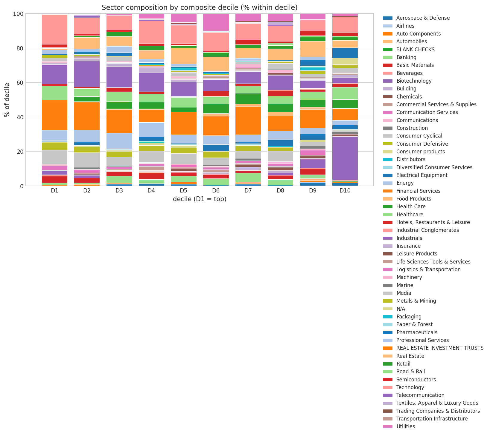

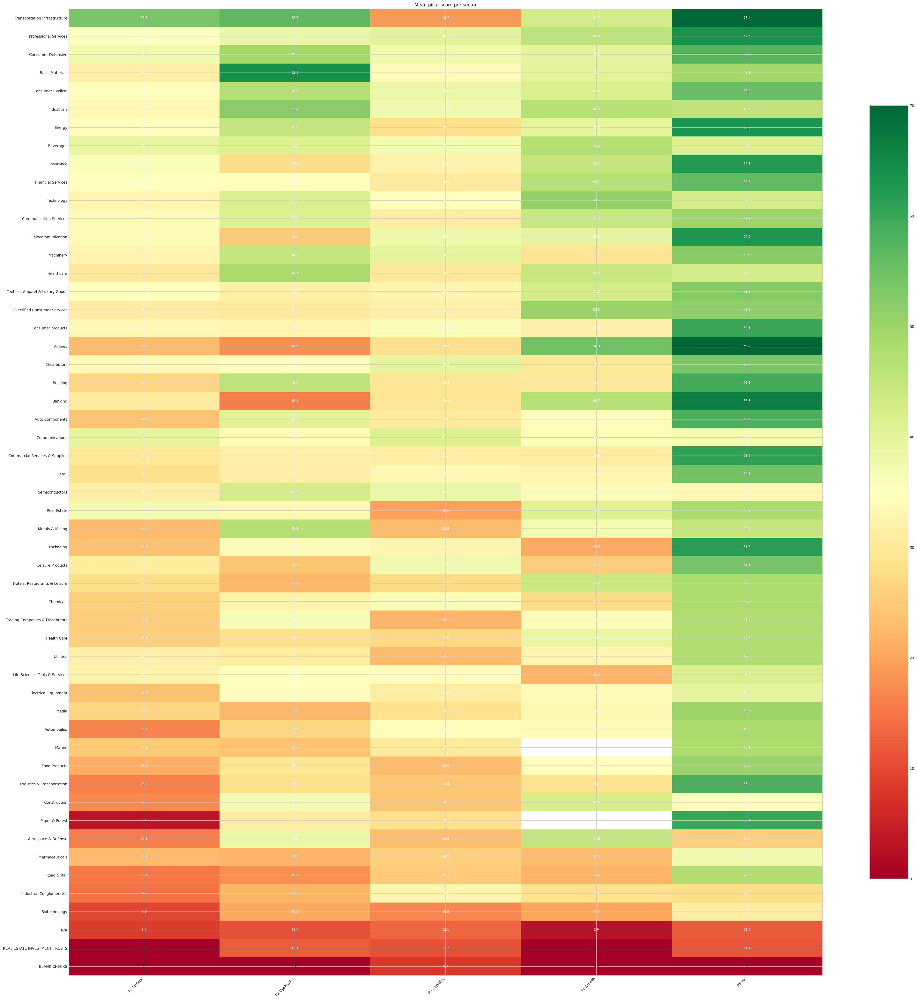

## 8. Market-cap tier by composite decile
**Interpretation:** D1 (top) tier mix: Large ($10B-$200B) 44.8%, Mid ($2B-$10B) 34.9%, Small (<$2B) 10.4%. Bottom decile tier mix: Small (<$2B) 52.4%, Mid ($2B-$10B) 40.6%, Large ($10B-$200B) 7.1%. If large/mega caps over-index in D1 relative to the universe, the framework favors size; if small caps over-index, the framework rewards scrappy scorers (and may be noisier).

**Stats:**
- `n` = 2114
- `tier_distribution`:
    - `Mid ($2B-$10B)` = 774
    - `Large ($10B-$200B)` = 682
    - `Small (<$2B)` = 605
    - `Mega (>$200B)` = 53

**Table — tier_pct_by_decile:**

| decile | Mega (>$200B) | Large ($10B-$200B) | Mid ($2B-$10B) | Small (<$2B) |
| --- | --- | --- | --- | --- |
| D1 | 9.910 | 44.810 | 34.910 | 10.380 |
| D2 | 4.270 | 53.550 | 30.810 | 11.370 |
| D3 | 1.420 | 45.970 | 34.120 | 18.480 |
| D4 | 2.830 | 43.870 | 30.190 | 23.110 |
| D5 | 2.370 | 36.490 | 36.970 | 24.170 |
| D6 | 0.470 | 33.180 | 36.970 | 29.380 |
| D7 | 2.360 | 21.230 | 43.400 | 33.020 |
| D8 | 0.950 | 18.960 | 39.810 | 40.280 |
| D9 | 0.470 | 17.540 | 38.390 | 43.600 |
| D10 | 0.000 | 7.080 | 40.570 | 52.360 |

**Table — tier_stats:**

| tier | count | mean | std |
| --- | --- | --- | --- |
| Large ($10B-$200B) | 682.000 | 41.720 | 12.370 |
| Mega (>$200B) | 53.000 | 48.880 | 13.950 |
| Mid ($2B-$10B) | 774.000 | 34.660 | 14.260 |
| Small (<$2B) | 605.000 | 28.990 | 13.390 |

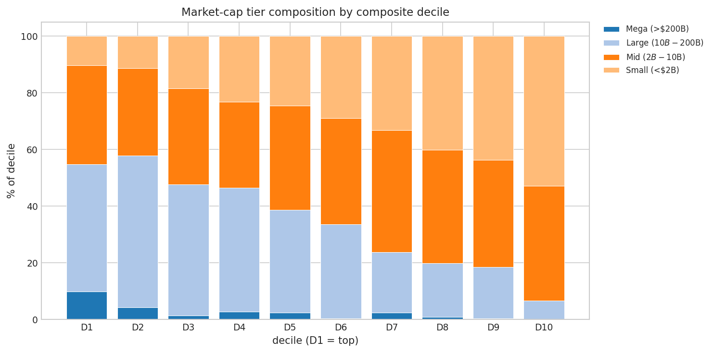

## 9. Valuation traps + rare P3 winners
**Interpretation:** Expensive-but-loved (composite≥70 AND P5<30): **1** symbols — these pass the quality bar but the valuation pillar flags them as rich. Reasonably-priced winners (composite≥70 AND P5≥70): **11** — should be prioritized for entry point analysis. Rare P3 winners (P3≥80): **4** out of 2125 — inspect the table to see whether high P3 is actually rewarding strong buyback/dividend/ROIC-WACC fundamentals (share_trend<0, payout_ratio in a reasonable band, roic_wacc_spread>0) or something spurious.

**Stats:**
- `expensive_but_loved` = 1
- `priced_winners` = 11
- `rare_p3_winners` = 4

**Table — expensive_but_loved:**

| symbol | sector | composite | P1 | P3 | P5 |
| --- | --- | --- | --- | --- | --- |
| KLAC | Technology | 75.000 | 81.400 | 86.900 | 23.000 |

**Table — priced_winners:**

| symbol | sector | composite | P1 | P3 | P5 |
| --- | --- | --- | --- | --- | --- |
| EXEL | Healthcare | 83.500 | 88.100 | 77.800 | 76.800 |
| QLYS | Technology | 79.800 | 86.700 | 78.200 | 81.200 |
| QCOM | Semiconductors | 78.100 | 84.500 | 87.100 | 72.600 |
| CALM | Consumer Defensive | 77.400 | 73.700 | 72.300 | 91.500 |
| AU | Basic Materials | 77.200 | 75.000 | 44.500 | 74.500 |
| DOCS | Healthcare | 76.200 | 81.600 | 63.500 | 72.200 |
| KGC | Metals & Mining | 75.100 | 76.800 | 51.200 | 80.600 |
| ADBE | Technology | 74.200 | 95.600 | 58.200 | 85.800 |
| OPFI | Technology | 73.000 | 90.400 | 38.000 | 84.200 |
| HRMY | Healthcare | 71.800 | 76.000 | 63.800 | 93.100 |
| DECK | Textiles, Apparel & Luxury Goods | 70.300 | 81.000 | 42.800 | 83.600 |

**Table — rare_p3_winners:**

| symbol | sector | composite | P1 | P3 | P5 | share_trend | payout_ratio | roic_wacc_spread |
| --- | --- | --- | --- | --- | --- | --- | --- | --- |
| QCOM | Semiconductors | 78.100 | 84.500 | 87.100 | 72.600 | -0.054 | 0.337 | 0.158 |
| MSCI | Financial Services | 67.000 | 71.100 | 86.900 | 44.300 | -0.069 | 0.463 | 0.256 |
| KLAC | Technology | 75.000 | 81.400 | 86.900 | 23.000 | -0.127 | 0.216 | 0.255 |
| NTAP | Technology | 61.300 | 71.300 | 80.300 | 73.800 | -0.107 | 0.342 | 0.111 |

## 10. Composite vs fundamentals + per-pillar diagnostic
**Interpretation:** **Composite vs core fundamentals** (Spearman): ROIC 0.7538, debt/EBITDA -0.5196, EV/EBITDA -0.3077, rev CAGR 3y 0.106. **Per-pillar vs should-be-strong fundamentals** — any row with verdict=BROKEN indicates scoring-logic failure for that pillar. No pillar-fundamental links are BROKEN.

**Stats:**
- `core_n` = 1957
- `broken_pillars` = []

**Table — composite_vs_fundamentals:**

| fundamental | n | spearman_r | spearman_p | pearson_r | pearson_p |
| --- | --- | --- | --- | --- | --- |
| ROIC | 1957.000 | 0.754 | 0.000 | 0.421 | 0.000 |
| debt_to_ebitda | 959.000 | -0.520 | 0.000 | -0.147 | 0.000 |
| EV_EBITDA | 1787.000 | -0.308 | 0.000 | -0.140 | 0.000 |
| revenue_cagr_3y | 1721.000 | 0.106 | 0.000 | -0.076 | 0.002 |

**Table — pillar_vs_fundamentals:**

| pillar_vs_fundamental | n | spearman_r | spearman_p | expected | verdict |
| --- | --- | --- | --- | --- | --- |
| P1 BizQual | 1957 | 0.739 | 0.000 | higher-better | OK |
| P2 OpsHealth | 959 | -0.602 | 0.000 | lower-better | OK |
| P3 CapAlloc(share_trend) | 1877 | -0.540 | 0.000 | more-negative = more buybacks | OK |
| P3 CapAlloc(payout_ratio) | 1138 | -0.380 | 0.000 | bell-shaped ideal | non-monotonic expected |
| P3 CapAlloc(roic_wacc) | 1957 | 0.585 | 0.000 | higher-better | OK |
| P4 Growth | 1721 | 0.626 | 0.000 | higher-better | OK |
| P5 Valuation | 1787 | -0.799 | 0.000 | lower-better | OK |

**Table — p3_diagnostic_correlations:**

| fundamental | n | spearman_r |
| --- | --- | --- |
| share_trend | 1877.000 | -0.540 |
| payout_ratio | 1138.000 | -0.380 |
| roic_wacc_spread | 1957.000 | 0.585 |

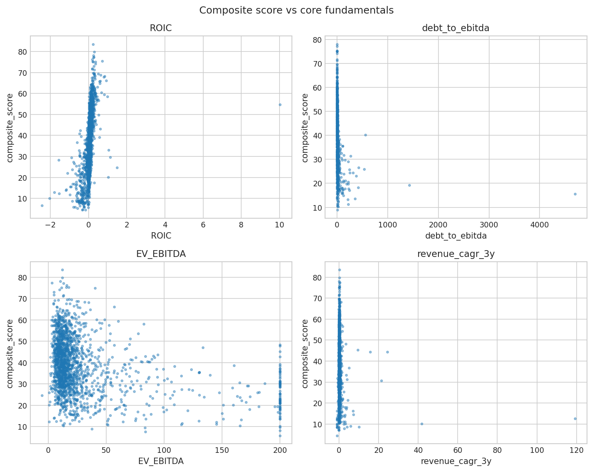

## 11. LLM vs quant alignment
**Interpretation:** Composite ↔ llm_conviction Spearman r=-0.311 (Pearson -0.123, n=1897). LLM recommendation is dominated by **STRONG_SELL** (63.6% of rated symbols) — if one bucket holds the majority the LLM is either calibrated very conservatively or being handed raw scores that push it there. Mean composite across 5 recommendation buckets is monotonic in the STRONG_BUY→STRONG_SELL ladder; non-monotonicity indicates the LLM disagrees with the quant in a structured way.

**Stats:**
- `n_composite_vs_conviction` = 1897
- `spearman_r` = -0.3108
- `pearson_r` = -0.1226
- `dominant_recommendation` = STRONG_SELL
- `dominant_pct` = 63.57
- `ladder_monotonic` = True

**Table — composite_by_recommendation:**

| llm_recommendation | count | mean | std | median |
| --- | --- | --- | --- | --- |
| STRONG_BUY | 4.000 | 71.650 | 9.740 | 71.650 |
| BUY | 38.000 | 63.520 | 10.410 | 63.900 |
| HOLD | 469.000 | 51.190 | 8.410 | 51.400 |
| SELL | 180.000 | 40.990 | 8.720 | 42.600 |
| STRONG_SELL | 1206.000 | 28.810 | 10.300 | 29.900 |

**Table — recommendation_counts:**

| llm_recommendation | count |
| --- | --- |
| STRONG_BUY | 4 |
| BUY | 38 |
| HOLD | 469 |
| SELL | 180 |
| STRONG_SELL | 1206 |

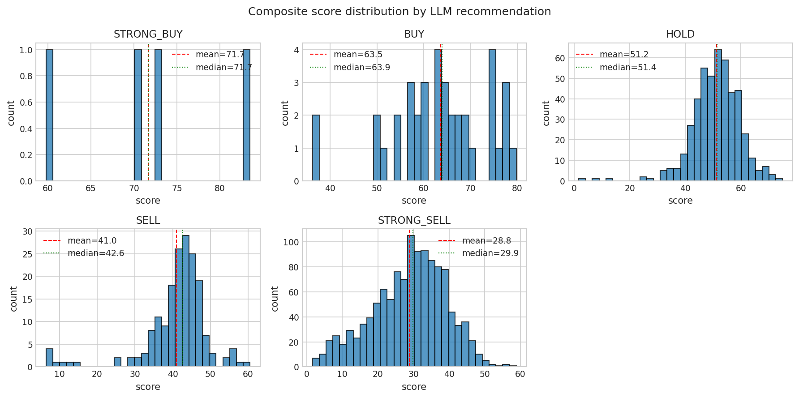

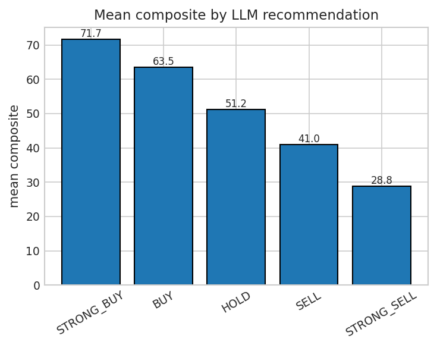

## 12. Score stability from history
**Interpretation:** 4435 consecutive snapshot pairs across 829 symbols, mean gap 2.2 days. Composite |Δ| distribution: 16.71% ≥5, 7.03% ≥10, 1.89% ≥20. **7.03% flagged unstable** (|Δ|≥10 AND gap ≤14 days). Noisiest pillar by mean |Δ|: **P2 OpsHealth** (4.22 avg absolute change). Rank is NULL throughout history; composite-score delta is the stability proxy.

**Stats:**
- `n_pairs` = 4435
- `n_symbols` = 829
- `mean_abs_delta` = 2.55
- `pct_abs_delta_ge_5` = 16.71
- `pct_abs_delta_ge_10` = 7.03
- `pct_abs_delta_ge_20` = 1.89
- `pct_unstable_flag` = 7.03
- `noisiest_pillar` = P2 OpsHealth

**Table — summary:**

| metric | value |
| --- | --- |
| n_pairs | 4435.000 |
| n_symbols | 829.000 |
| mean_days_between | 2.200 |
| median_days_between | 2.010 |
| mean_abs_delta | 2.550 |
| median_abs_delta | 0.100 |
| mean_per_day_abs | 0.788 |
| pct_abs_delta_ge_5 | 16.710 |
| pct_abs_delta_ge_10 | 7.030 |
| pct_abs_delta_ge_20 | 1.890 |
| pct_unstable_flag | 7.030 |

**Table — per_pillar:**

| pillar | n | mean_abs_delta | median_abs_delta | pct_ge_5 | pct_ge_10 |
| --- | --- | --- | --- | --- | --- |
| P1 BizQual | 4375.000 | 1.202 | 0.000 | 6.930 | 4.550 |
| P2 OpsHealth | 4373.000 | 4.219 | 0.000 | 22.960 | 18.660 |
| P3 CapAlloc | 4435.000 | 2.605 | 0.000 | 13.960 | 8.570 |
| P4 Growth | 3867.000 | 3.524 | 0.000 | 18.210 | 14.970 |
| P5 Val | 4397.000 | 2.021 | 0.100 | 8.300 | 6.120 |

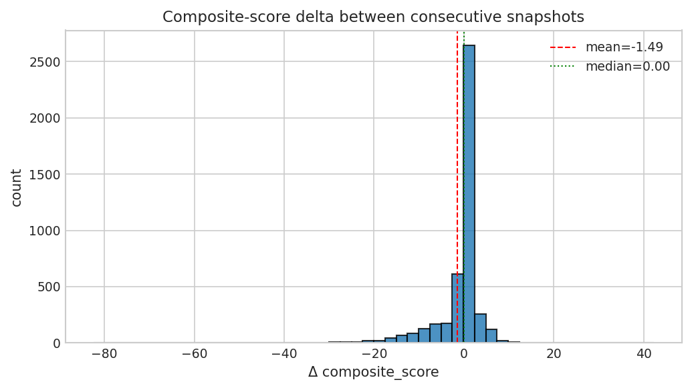

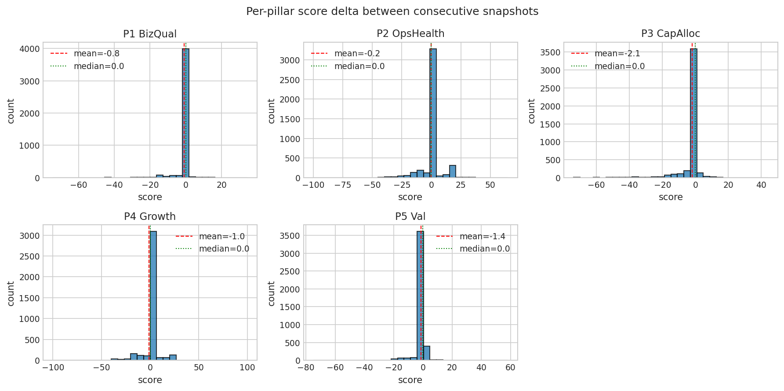

**Notes:**
- Rank is NULL in evaluation_history for every row; composite-score delta used as stability proxy.

## 13. Evaluation version audit
**Interpretation:** Single evaluation_version `0.2.0` covers all 2125 rows. No cross-version contamination risk; version filter in the audit is effectively a no-op.

**Stats:**
- `n_versions` = 1
- `dominant_version` = 0.2.0
- `dominant_pct` = 100.0
- `selected_filter` = 0.2.0

**Table — version_distribution:**

| evaluation_version | n | pct_of_total |
| --- | --- | --- |
| 0.2.0 | 2125.000 | 100.000 |

## Framework Concerns
- **P2 sub-metric coverage (data-provider gap).** `debt_to_ebitda` and `sga_efficiency` fall below 50% coverage primarily because Polygon does not populate `long_term_debt` and `selling_general_administrative` for many financials, REITs, and utilities — not because of sentinel coercion. The only string sentinel in P2 is `no_debt` on `interest_coverage`, which is already mapped to score=100 in the scoring layer. (The `routine_selling` sentinel lives in P3's smart-money analyzer and the breakout logic; it does not touch P2.) Full normalization details are in `docs/P2_NORMALIZATION_REFERENCE.md`.

## Framework Strengths
- **No redundant pillar pair** (Analysis 1): max |Pearson r| = 0.58 < 0.7 between any two pillar scores.
- **Multi-factor framework retained** (Analysis 3): PC1 = 47.7% < 50% — pillars genuinely capture distinct dimensions rather than collapsing to a single axis.
- **Composite distribution is well-shaped** (Analysis 5): skew=0.04, excess kurtosis=-0.31 — symmetric and platykurtic, clean discrimination across the universe.

## Appendix A: SQL Queries

### `evaluation_version_distribution`
```sql
SELECT
    COALESCE(evaluation_version, '<null>') AS evaluation_version,
    COUNT(*)                               AS n
FROM company_evaluations
GROUP BY evaluation_version
ORDER BY n DESC
```

### `company_evaluations`
```sql
SELECT
    symbol,
    company_name,
    sector,
    industry,
    market_cap,
    pillar_1_business_quality,
    pillar_2_operational_health,
    pillar_3_capital_allocation,
    pillar_4_growth_quality,
    pillar_5_valuation,
    composite_score,
    rank,
    pillar_1_detail,
    pillar_2_detail,
    pillar_3_detail,
    pillar_4_detail,
    pillar_5_detail,
    llm_recommendation,
    llm_conviction,
    raw_financials,
    evaluated_at,
    data_freshness,
    evaluation_version
FROM company_evaluations
WHERE composite_score IS NOT NULL
  AND (:version IS NULL OR evaluation_version = :version)
```

### `universe_symbols`
```sql
SELECT
    symbol,
    market_cap_tier,
    tier,
    sector AS universe_sector,
    industry AS universe_industry
FROM universe_symbols
WHERE active = 1
```

### `evaluation_history`
```sql
SELECT
    h.symbol,
    h.composite_score,
    h.rank,
    h.evaluated_at,
    h.llm_recommendation,
    h.snapshot
FROM evaluation_history h
WHERE h.composite_score IS NOT NULL
  AND h.symbol IN (
      SELECT symbol
      FROM evaluation_history
      WHERE composite_score IS NOT NULL
      GROUP BY symbol
      HAVING COUNT(*) >= 2
  )
ORDER BY h.symbol, h.evaluated_at
```

### `universe_size`
```sql
SELECT COUNT(*) AS n
FROM company_evaluations
WHERE composite_score IS NOT NULL
  AND (:version IS NULL OR evaluation_version = :version)
```

## Appendix B: Methodology Notes
- NULL composite_score rows were excluded at the SQL level.
- Filtered to evaluation_version = `0.2.0`; other versions excluded.
- Deciles use `pd.qcut(composite_score, 10, labels=D1..D10, duplicates='drop')` with D1 = top.
- Within-pillar sub-metric extraction tolerates missing or malformed JSON (row skipped, noted in Analysis 2). Sub-metrics with <50% coverage across the universe are dropped.
- Analysis 12 measures **composite-score delta** between consecutive history snapshots per symbol, not rank delta, because `evaluation_history.rank` is NULL for all rows — rank is computed and persisted only to `company_evaluations`. Thresholds: |Δ|≥5, ≥10, ≥20; flagged-as-unstable = |Δ|≥10 AND gap ≤ 14 days.
- Normality test (Analysis 5): Anderson-Darling + Shapiro-Wilk reported, but at n≈2000 both trivially reject for minor deviations. Skew and kurtosis are the operative shape summaries.
- Sector (Analysis 7) taken from `company_evaluations.sector` (evaluation-time snapshot, authoritative for that run).
- Analyses may reference slightly different N values due to ongoing crawler activity during audit execution (observed drift ~1% between STOP 1 and STOP 3); this does not change any structural conclusions.
